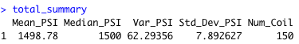
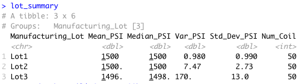
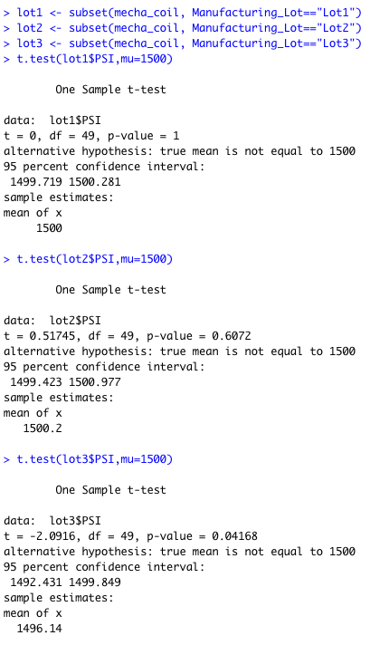

# MechaCar_Statistical_Analysis
## Overview
From this challenge, I was able to perfrom data analysis for AutosRUs' newest prototype, the MechaCar. The MechaCar is suffering from prudction troubles that are blocking the manufacturing team's progress. In order to ease the trouble, below data analysis were performed:
- multiple lineal regression analysis
- collect summary statistics on the pounds per square inch of the suspension coils from the manufacturing lots
- run t-tests to determine if the manufacturing lots are statistically different from the mean population
- designa a statistical study to compare vehicle performance of the MechaCar vehicles against vehicles from other manufactures

## Summary Statistics on Suspension Coils

Total Summary table
### 

Lot Summary table
### 

## T-Tests on Suspension Coils

### 
